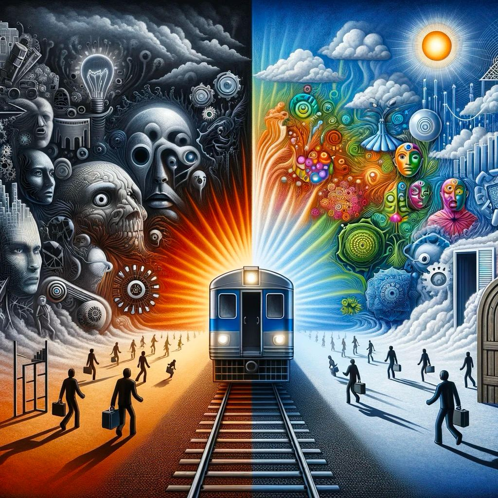

Дата: 28 ноября 2023 года

• Обзор ведущих и участников
• Формат и цели курса
• Обзор интерфейсов для работы с ИИ
• Как устроены языковые модели

**presentation**

[AI Mindset Lecture 1 presentation](https://gamma.app/public/AI-Mindset-lc7k1o0eu1clz0k)

# AI Mindset: Встреча 1

## Представление ведущих и участников

[00:00](https://youtu.be/t5xIPmWNmEE?t=0)

В начале встречи ведущие Александр и Глеб представляются и рассказывают о своем опыте работы в IT и интересе к искусственному интеллекту.

Затем участники делятся на микрогруппы по 3-4 человека для знакомства и обсуждения. Они делятся информацией о том, где находятся, как себя чувствуют и чего ждут от курса по искусственному интеллекту.

После обсуждения представители групп делают краткие выводы. Отмечается, что участники в целом находятся в начале пути освоения ИИ, они хотят лучше понять возможности этих технологий и научиться применять их в своей работе и повседневной жизни.

## Формат и цели курса

[07:37](https://youtu.be/t5xIPmWNmEE?t=457)

Далее ведущий Глеб объясняет формат и цели данного курса:

- Основная цель - выработать у участников устойчивую привычку ежедневного использования инструментов ИИ.
- Большой акцент будет сделан на практических занятиях, взаимодействии в микрогруппах, обсуждении и реализации проектов.
- Курс рассчитан на 7 встреч продолжительностью 1.5-2 часа каждая.
- Первая часть встречи - это лекция и демонстрации от ведущих.
- Во второй части проводится групповая работа и обсуждение.
- Также будут задаваться домашние задания для закрепления пройденного материала.

Отмечается, что курс рассчитан в первую очередь на формирование устойчивых навыков по работе с инструментами ИИ, а не на получение большого объема новых знаний.

## Групповая работа: Ожидания от курса

В микрогруппах участники обсуждают свои ожидания от курса по ИИ. Отмечается заинтересованность в практическом применении ИИ в работе и жизни.

1. **Начальная Точка:** Участники ощущают себя новичками в ИИ и стремятся улучшить свое взаимодействие с технологией, расширяя собственные представления и понимание ИИ.

2. **Индивидуальные Цели:**

- Иван из Москвы ищет способы интеграции ИИ в свои текущие проекты и жизнь.

- Клим из Франции хочет расширить использование ИИ за рамки текстовых задач, включая повседневные дела.

- Лиза стремится использовать ИИ как инструмент для оценки реализуемости и планирования своих проектных идей.

3. **Ожидания от Лаборатории:** Участники ожидают, что лаборатория поможет им глубже понять возможности ИИ, научит применять эти знания в различных сферах, от творчества до профессиональной деятельности.

4. **Эмоциональный и Социальный Контекст:** Общее настроение участников под влиянием времени года, однако участие в лаборатории приносит новый стимул и повышает их интерес к исследованию ИИ.

## Обзор интерфейсов для работы с AI

[29:56](https://youtu.be/t5xIPmWNmEE?t=1796)

Далее Александр переходит к обзору популярных интерфейсов, которые используются для работы с искусственным интеллектом:

- **ChatGPT** - это интерфейс для общения с языковой моделью GPT в формате чата. Доступен через веб-сайт и мобильные приложения.
- **Claude** - языковая модель от Anthropic, ориентированная на работу с большими объемами текста.
- **POE** - приложение, которое предоставляет доступ к различным инструментам ИИ, включая языковые модели и генераторы изображений.
- **Al Mindset — Workbench** – демонстрация того, как можно использовать общего группового бота в рамках лаборатории

Основные возможности этих интерфейсов:

- Задавать вопросы и взаимодействовать с моделью на естественном языке
- Загружать текстовые файлы и изображения для предоставления дополнительного контекста
- Генерировать ответный текст или изображения в соответствии с запросом
- Вести многократный диалог с сохранением контекста беседы

Для демонстрации возможностей Александр запускает Telegram-бота, который использует модели GPT и Stable Diffusion.

## Как устроены языковые модели

[41:01](https://youtu.be/t5xIPmWNmEE?t=2461)

Далее следует объяснение принципов работы языковых моделей на примере GPT:

- Описываются этапы создания модели: сбор данных из интернета, предобучение на основе этих данных, дообучение с использованием проверенных примеров вопросов и ответов.
- Объясняется, что модель работает на основе вероятностей и предсказания следующего слова в тексте.
- Чем больше контекста - тем точнее предсказание и лучше ответ.
- Перечисляются ограничения моделей: не умеют думать, забывают контекст, нуждаются в большом количестве примеров.
- Упоминаются различные подходы к улучшению моделей за счет больших вычислительных мощностей или очистки данных.

## Групповая работа: Страхи и Надежды в связи с ИИ

[55:22](https://youtu.be/t5xIPmWNmEE?t=3322)

Участники делятся на группы и обсуждают свои опасения и надежды в связи с развитием ИИ.

Среди опасений - высокие темпы развития технологий, риск потери работы, обесценивание творчества и культуры.

В то же время высказывается воодушевление и надежда, что ИИ станет новой ступенью эволюции и принесет позитивные изменения.

**Страхи:**

1. **Технологическое Устаревание:** Быстрое развитие технологий вызывает страх отставания и пропуска важных трендов.

2. **Обесценивание Творчества:** Страх, что ИИ может заменить человеческое творчество, уменьшая ценность усилий и обучения.

3. **Потеря Работы:** Боязнь, что ИИ превзойдет человеческие способности в выполнении задач, ведущая к потере рабочих мест.

4. **Высокий Порог Вхождения:** Трудности в освоении ИИ и достижении положительных результатов на начальном этапе.

**Надежды:**

1. **Воодушевление от Новизны:** Восприятие ИИ как новой границы в эволюции и развитии.

2. **Трансформация Творчества:** Надежда на то, что ИИ изменит характер творчества, перенося фокус на новые области.

3. **Положительные Изменения:** Оптимизм относительно баланса между страхами и надеждами, с акцентом на ожидаемые положительные изменения.

## Групповая работа: опыт использования ИИ

[1:20:30](https://youtu.be/t5xIPmWNmEE?t=4830)

Участники делятся своим опытом использования инструментов ИИ:

- ChatGPT - для решения бытовых задач, помощи в работе, написания текстов, программирования.
- Stable Diffusion - для генерации картинок, обложек, аватаров по текстовому описанию.
- Midjourney - для создания художественных образов и визуализации идей.
- Интерес к обучению и тонкой настройке моделей под конкретные задачи.
- Обсуждаются преимущества голосового пользовательского интерфейса и возможности мультимодального взаимодействия с ИИ.Примеры использования Whisper

## Архитектура моделей LLM

[1:30:30](https://youtu.be/t5xIPmWNmEE?si=r14VViseC9mtFwBo&t=5430)

Подробно рассматривается техническая архитектура больших языковых моделей (LLM):

- Используются архитектуры трансформеров, состоящие из кодировщиков и декодировщиков.
- Модель содержит миллиарды параметров, обучается на огромных массивах текстов.
- В процессе обучения вычисляются условные вероятности последовательности слов.
- При генерации текста модель предсказывает наиболее вероятное следующее слово.
- 

## Обратная связь и Домашнее задание

[1:44:14](https://youtu.be/t5xIPmWNmEE?si=rvTqyaIxEUCrvuxO&t=6254)

**ДЗ  на следующую неделю:**

- Опробовать ChatGPT, Midjourney, Whisper.
- Подумать над темой проекта для реализации.
- Изучить дополнительные материалы по ИИ.